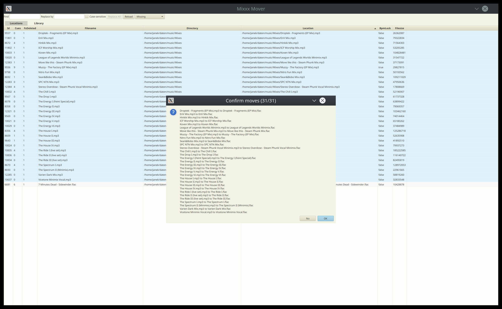

# mixxxdb-kt

[Kotlin](https://kotlinlang.org) accessors for the [SQLite](https://sqlite.org) library database of [Mixxx](https://mixxx.org),
the free and open source cross-platform DJ software.

## mixxx-file-mover

Adjust file locations in the mixxxdb in bulk to retain metadata after reorganising your library on disk.
Can be run through [Gradle](https://gradle.org) with `./gradlew run`.

This is a small personal project that has often aided me in updating locations of Tracks
after moves and renames to retain all metadata.
But some features are a little wonky and the interface is not self-explanatory,
so make a backup of your database before trying it.

Feel free to examine and build upon it though :)

